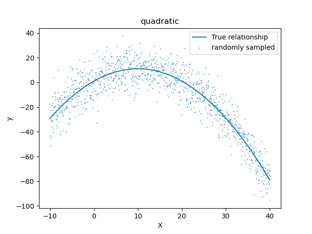

### Examples

## Fundamentals

### `Summarizing a tensor`

```python
import tensorflow as tf
from src.utils import describe_tensor

# set seed
tf.random.set_seed(42)

# make a random tensor
tensor = tf.random.normal(shape=(1, 3, 3))

# describe the tensor
describe_tensor(tensor)
```

```
Datatype: <dtype: 'float32'>
Number of dimensions: 3
Shape of tensor: (1, 3, 3)
Elements along the 0 axis: 1
Elements along the last axis: 3
Total number of elements: 9
```

```python
from src.utils import get_tensor_statistics

# get basic statistics of the tensor
get_tensor_statistics(tensor)
```
```
min: tf.Tensor(-2.3880599, shape=(), dtype=float32)
max: tf.Tensor(1.6994323, shape=(), dtype=float32)
mean: tf.Tensor(-0.3720852, shape=(), dtype=float32)
sum: tf.Tensor(-3.3487668, shape=(), dtype=float32)
std: tf.Tensor(1.1511972, shape=(), dtype=float32)
variance: tf.Tensor(1.325255, shape=(), dtype=float32)
```

## Neural Network Regression

### `PolynomialModel`

```python
import numpy as np
import matplotlib.pyplot as plt
from src.models import PolynomialModel

# input 1D feature
xmin, xmax = -10, 40 # range
m = 1000 # no of data points
X = np.expand_dims(np.linspace(xmin, xmax, m), axis=-1) # You can randomly sample as well

# polynomial model of any degree
quadmodel = PolynomialModel(params=[1, 2, -0.1], stderr=10)

# Now sample the targets
y = quadmodel(X, add_noise=True)

# Plot
fig, ax = plt.subplots()
ax.scatter(X.flatten(), y.flatten(), s=0.2, label='randomly sampled')
quadmodel.plot(X, ax=ax, label='True relationship')
ax.set(title='quadratic', xlabel='X', ylabel='y')
plt.legend()
```



### `OLSRegressor`

```python
from src.models import OLSRegressor
from sklearn.linear_model import LinearRegression

olsmodel = OLSRegressor(add_bias=True)
olsmodel.fit(np.hstack([X, X**2]), y)

linregmodel = LinearRegression()
linregmodel.fit(np.hstack([X, X**2]), y)

print('OLSRegressor results:\n----')
print(f'intercept: {olsmodel.intercept_[0]}, coefficients: {olsmodel.coef_}')
print('----\n')

print('LinearRegression results:\n----\n')
print(f'intercept: {linregmodel.intercept_}, coefficients: {linregmodel.coef_}')
print('----\n')
```

```
OLSRegressor results:
----
intercept: 1.2699100651176205, coefficients: [ 1.91208921 -0.09832959]
----

LinearRegression results:
----

intercept: 1.269910065117589, coefficients: [ 1.91208921 -0.09832959]
----
```

