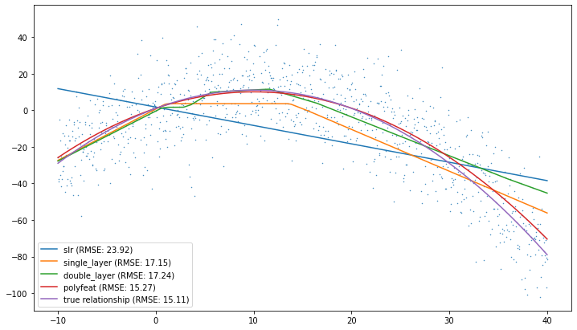
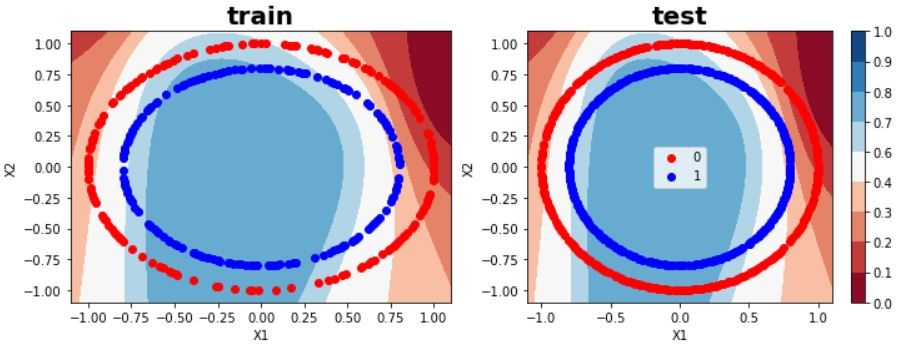
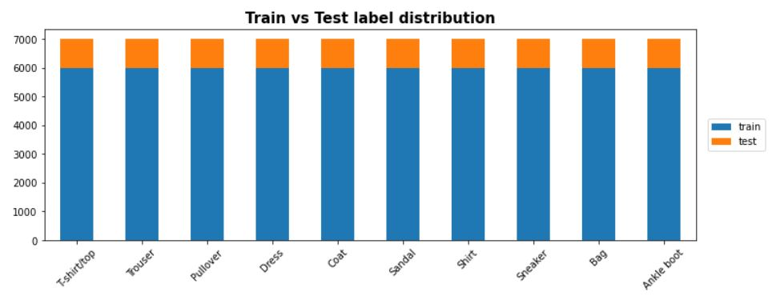
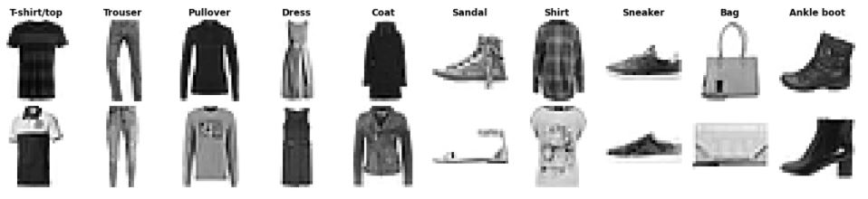
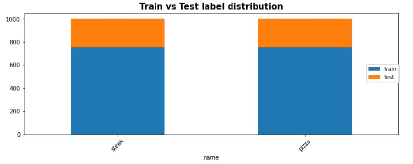
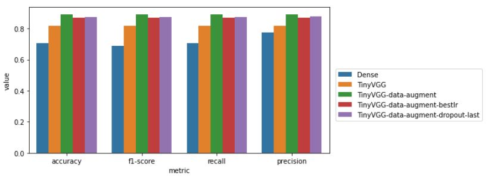
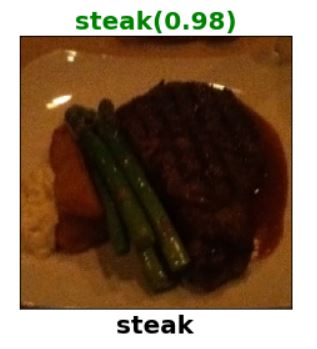
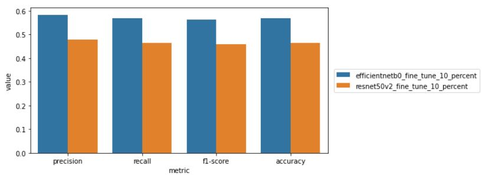
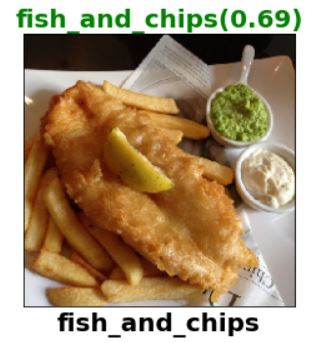

# Examples

## Fundamentals

### `Summarizing a tensor`

```python
import tensorflow as tf
from src.utils import describe_tensor

# set seed
tf.random.set_seed(42)

# make a random tensor
tensor = tf.random.normal(shape=(1, 3, 3))

# describe the tensor
describe_tensor(tensor)
```

```
Datatype: <dtype: 'float32'>
Number of dimensions: 3
Shape of tensor: (1, 3, 3)
Elements along the 0 axis: 1
Elements along the last axis: 3
Total number of elements: 9
```

```python
from src.utils import get_tensor_statistics

# get basic statistics of the tensor
get_tensor_statistics(tensor)
```
```
min: tf.Tensor(-2.3880599, shape=(), dtype=float32)
max: tf.Tensor(1.6994323, shape=(), dtype=float32)
mean: tf.Tensor(-0.3720852, shape=(), dtype=float32)
sum: tf.Tensor(-3.3487668, shape=(), dtype=float32)
std: tf.Tensor(1.1511972, shape=(), dtype=float32)
variance: tf.Tensor(1.325255, shape=(), dtype=float32)
```

## Neural Network Regression

### `PolynomialModel`

```python
import numpy as np
import matplotlib.pyplot as plt
from src.models import PolynomialModel

# input 1D feature
xmin, xmax = -10, 40 # range
m = 1000 # no of data points
X = np.expand_dims(np.linspace(xmin, xmax, m), axis=-1) # You can randomly sample as well

# polynomial model of any degree
quadmodel = PolynomialModel(params=[1, 2, -0.1], stderr=10)

# Now sample the targets
y = quadmodel(X, add_noise=True)

# Plot
fig, ax = plt.subplots()
ax.scatter(X.flatten(), y.flatten(), s=0.2, label='randomly sampled')
quadmodel.plot(X, ax=ax, label='True relationship')
ax.set(title='quadratic', xlabel='X', ylabel='y')
plt.legend()
```


### `OLSRegressor`

```python
from src.models import OLSRegressor
from sklearn.linear_model import LinearRegression

olsmodel = OLSRegressor(add_bias=True)
olsmodel.fit(np.hstack([X, X**2]), y)

linregmodel = LinearRegression()
linregmodel.fit(np.hstack([X, X**2]), y)

print('OLSRegressor results:\n----')
print(f'intercept: {olsmodel.intercept_[0]}, coefficients: {olsmodel.coef_}')
print('----\n')

print('LinearRegression results:\n----\n')
print(f'intercept: {linregmodel.intercept_}, coefficients: {linregmodel.coef_}')
print('----\n')
```

```
OLSRegressor results:
----
intercept: 1.2699100651176205, coefficients: [ 1.91208921 -0.09832959]
----

LinearRegression results:
----

intercept: 1.269910065117589, coefficients: [ 1.91208921 -0.09832959]
----
```

### `Quadratic Regression Model Comparison`



|Model   | Parameters  | RMSE |
|---|---|---|
|slr| 2| 23.92|
|single_layer| 49| 17.15|
|double_layer| 177| 17.24|
|polyfeat| 3| 15.27|
|true relationship| -| 15.11|

`polyfeat` was a simple linear regression model but with 2 degree polynomial features. This had the lowest number of parameters and also the lowest RMSE! Goes on to show the importance of feature engineering, and also kernel methods even for neural networks!

#### `Comparing Model Weights`

```python
from src.utils import check_tfmodels_weight_equality

# train model
model.fit(X, y)
# save model
model.save('model')
# load model
loaded_model = tf.keras.models.load_model('model')
# check if weights are equal
print(check_tfmodels_weight_equality(model, loaded_model))
```

```
True
```

### `BoxCoxTransformer`

```python
import pandas as pd
from src.preprocess import BoxCoxTransformer

df = pd.read_csv('../data/medical_cost/medical_cost.csv')
orig = df['charges'].to_numpy()

bctrans = bctrans = BoxCoxTransformer(alpha=0.05)
transformed = bctrans.fit_transform(orig)

fig, (ax1, ax2) = plt.subplots(1, 2, figsize=(12, 4))

ax1.hist(orig, bins=10)
ax1.set_title('original')
ax2.hist(transformed, bins=10,color='orange');
ax2.set_title('box-cox transformed');
```


## Neural Network Classification

### `TensorflowPlayground`

#### Features

A teeny tiny reimplementation of the https://playground.tensorflow.org/

* Start, pause, resume and reset training
    * Set max epochs
* Adjust Learning rate (+ Optimizer)
* Adjust activation (overall except last layer)
    * First layer activation option also
* Add Regularization (Overall all weights, [L1, L2])
    * Adjusting regularization rate
* Choose datasets - circle, exclusive_or, gaussian, spiral
    * Ratio of training to test data
    * Noise level
* Choose Features - X1, X2, X1_sq,X2_sq, X1X2, sin(X1), sin(X2)
* Choose architecture - no of hidden layers, no or neurons in each layer
* Monitor/Plot learning curves
* Monitor/Plot decision boundary
    * Option to show test data
    * Option to discretize output


`Setup your playground!`

```python
tfp = TensorflowPlayground(dataset='circle', 
                           features=['X1', 'X2'], 
                           neurons=[8, 4],
                           activation='sigmoid',
                           learning_rate=0.1,
                           scale=True)
```

`Plot the data!`

```python
tfp.data.plot()
```


`Train the model!`

```python
tfp.train(epochs=15, batch_size=30)
```
```
Epoch 1/15
12/12 [==============================] - 1s 3ms/step - loss: 0.7062
Epoch 2/15
12/12 [==============================] - 0s 3ms/step - loss: 0.6944
Epoch 3/15
12/12 [==============================] - 0s 3ms/step - loss: 0.7057
Epoch 4/15
12/12 [==============================] - 0s 3ms/step - loss: 0.6963
Epoch 5/15
12/12 [==============================] - 0s 3ms/step - loss: 0.6937
Epoch 6/15
12/12 [==============================] - 0s 3ms/step - loss: 0.6931
Epoch 7/15
12/12 [==============================] - 0s 3ms/step - loss: 0.6909
Epoch 8/15
12/12 [==============================] - 0s 3ms/step - loss: 0.6891
Epoch 9/15
12/12 [==============================] - 0s 3ms/step - loss: 0.6931
Epoch 10/15
12/12 [==============================] - 0s 3ms/step - loss: 0.6960
Epoch 11/15
12/12 [==============================] - 0s 5ms/step - loss: 0.6851
Epoch 12/15
12/12 [==============================] - 0s 3ms/step - loss: 0.6787
Epoch 13/15
12/12 [==============================] - 0s 3ms/step - loss: 0.6704
Epoch 14/15
12/12 [==============================] - 0s 3ms/step - loss: 0.6470
Epoch 15/15
12/12 [==============================] - 0s 3ms/step - loss: 0.6076
```
`Plot the learning curve!`

```python
tfp.plot_learning_curve();
```


```

`Plot the predictions`

```python
fig, axn = plt.subplots(1, 2, figsize=(12, 4))

for ax, subset in zip(axn, ['train', 'test']):
    cp = tfp.plot_decision_function(ax=ax)
    tfp.data.plot(subset=subset, ax=cp.axes)
    
    ax.set_title(subset, fontdict=dict(weight='bold', size=20))
    

fig.colorbar(cp);
```



`Analyze the peformance`

```python
tfp.plot_confusion_matrix();
```


### `Fashion MNIST`

```python
from tensorflow.keras.datasets import fashion_mnist

# The data has already been sorted into training and testing sets
(train_images, train_labels), (test_images, test_labels) = fashion_mnist.load_data()

# Name of the classes
class_names =  ['T-shirt/top', 'Trouser', 'Pullover', 'Dress', 'Coat',
               'Sandal', 'Shirt', 'Sneaker', 'Bag', 'Ankle boot']

n_classes = len(class_names)
```

Custom `ImageDataset`

```python
from src.image import ImageDataset

imgds = ImageDataset((train_images, train_labels), (test_images, test_labels), class_names)
```

Plot the label counts
```python
imgds.plot_labelcounts();
```



View random images
```python
imgds.view_random_images(class_names='all', n_each=2, subset='train');
```



Model Performance Comparison
```python
from src.evaluate import ClassificationPerformanceComparer

clf_comp = ClassificationPeformanceComparer(models, test_data)
clf_comp.calculate_metric_comparison_df()
clf_comp.plot_metric_comparison_df();
```


## `Computer Vision`

### `Pizza Steak Image Classifier`

`ClassicImageDataDirectory`

```python
import os
import numpy as np
import pandas as pd
import matplotlib.pyplot as plt
from src.image import ClassicImageDataDirectory

data_dir = '../data/pizza_steak/'
subsets = ['train', 'test']
class_names = ['pizza', 'steak']

imgdir = ClassicImageDataDirectory(data_dir, target_image_size=(224, 224), dtype=np.uint8)
```

Class Names

```python
imgdir.class_names, imgdir.class_labels
```
```
(('steak', 'pizza'), (0, 1))
```

Counts

```python
imgdir.labelcountdf
```
| | | | | |
|--|--|--|--|--|
|	|label|	name|	count_train|	count_test|
0	|0	|steak|	750|	250|
1	|1	|pizza|	750|	250|

Visualize Counts
```python
imgdir.plot_labelcounts()
```



Load and view a batch

```python
datagen = imgdir.load(32)
batch = next(datagen)
batch.view_random_images(class_names='all', n_each=3);
```


Model Performance Comparison



Prediction on random image

```python
view_random_prediction(model=tfmodels['TinyVGG-data-augment'], data_dir='../data/pizza_steak/', subset='test', datagen=test_datagen, target_image_size=(224, 224));
```



## `Transfer Learning`

### Image Classification Experiments

```python
from tensorflow.keras.preprocessing.image import ImageDataGenerator
import tensorflow.keras.layers.experimental.preprocessing as KerasPreprocessing
import tensorflow as tf
from tensorflow.keras import layers, losses, callbacks, optimizers
from src.evaluate import KerasMetrics
from pathlib import Path

from src.image import ImageClassificationExperiment

TFHUB_LOGDIR = str(Path(os.path.abspath('../tensorboard_logs/101_food_multiclass_classification')))

experiments = {} # to store all experiments

exp_1 = ImageClassificationExperiment(name='efficientnetb0_fine_tune_10_percent', 
                                    tfhub_log_dir=TFHUB_LOGDIR)
exp_1.preprocess_data(scale=False)
exp_1.setup_directories(data_dir='../data/101_food_classes_10_percent/')
exp_1.import_data_from_directories()
```
```
Found 6060 images belonging to 101 classes.
Found 1515 images belonging to 101 classes.
Found 25250 images belonging to 101 classes.
```

```python
exp_1.create_model(pretrained_model=tf.keras.applications.EfficientNetB0(include_top=False),
                 downstream_model=None) # None sets a default GlobalMaxPool2D downstream layer   
exp_1.compile_model()
```
Train in `feature_extraction` mode for 5 epochs

```python
exp_1.run(5, tfhub_log=True)
```
```
Saving TensorBoard log files to " C:\Users\bhati\Google Drive\projects\Tensorflow-tutorial-Daniel-Bourke\tensorboard_logs\101_food_multiclass_classification\efficientnetb0_fine_tune_10_percent\feature_extraction\20210605-141956"
Epoch 1/5
190/190 [==============================] - 81s 392ms/step - loss: 4.1402 - f1: 0.0034 - accuracy: 0.1222 - val_loss: 2.8358 - val_f1: 0.0861 - val_accuracy: 0.3525
Epoch 2/5
190/190 [==============================] - 66s 345ms/step - loss: 2.6281 - f1: 0.1078 - accuracy: 0.4233 - val_loss: 2.3871 - val_f1: 0.2165 - val_accuracy: 0.4277
Epoch 3/5
190/190 [==============================] - 65s 341ms/step - loss: 2.1849 - f1: 0.2431 - accuracy: 0.4957 - val_loss: 2.2139 - val_f1: 0.3197 - val_accuracy: 0.4521
Epoch 4/5
190/190 [==============================] - 67s 350ms/step - loss: 1.8822 - f1: 0.3489 - accuracy: 0.5575 - val_loss: 2.1186 - val_f1: 0.3495 - val_accuracy: 0.4686
Epoch 5/5
190/190 [==============================] - 73s 381ms/step - loss: 1.7409 - f1: 0.4056 - accuracy: 0.5916 - val_loss: 2.0706 - val_f1: 0.3880 - val_accuracy: 0.4746
```

Train in `fine_tuning` mode for another 5 with last 10 layers unfreezed

```python
exp_1.set_training_mode('fine_tuning')
exp_1.compile_model(learning_rate=0.0001) # lower the learning rate by 1/10th for fine tuning
exp_1.run(5, tfhub_log=True)
```
```
Saving TensorBoard log files to " C:\Users\bhati\Google Drive\projects\Tensorflow-tutorial-Daniel-Bourke\tensorboard_logs\101_food_multiclass_classification\efficientnetb0_fine_tune_10_percent\fine_tuning\20210605-142806"
Epoch 5/9
190/190 [==============================] - 104s 509ms/step - loss: 1.6857 - f1: 0.4295 - accuracy: 0.5943 - val_loss: 2.0144 - val_f1: 0.4419 - val_accuracy: 0.4865
Epoch 6/9
190/190 [==============================] - 81s 427ms/step - loss: 1.4924 - f1: 0.5119 - accuracy: 0.6456 - val_loss: 1.9807 - val_f1: 0.4578 - val_accuracy: 0.5030
Epoch 7/9
190/190 [==============================] - 69s 361ms/step - loss: 1.3978 - f1: 0.5517 - accuracy: 0.6653 - val_loss: 1.9626 - val_f1: 0.4754 - val_accuracy: 0.5076
Epoch 8/9
190/190 [==============================] - 68s 359ms/step - loss: 1.3178 - f1: 0.5747 - accuracy: 0.6802 - val_loss: 1.9427 - val_f1: 0.4843 - val_accuracy: 0.5135
Epoch 9/9
190/190 [==============================] - 68s 359ms/step - loss: 1.2405 - f1: 0.6016 - accuracy: 0.7101 - val_loss: 1.9384 - val_f1: 0.4925 - val_accuracy: 0.5149
```
Learning Curve

```python
experiments[exp_1.name] = exp_1 # Store it
exp_1.plot_learning_curve();
```


Now create another experiment with `resnet50v2`

```python
exp_2 = ImageClassificationExperiment(name='resnet50v2_fine_tune_10_percent', tfhub_log_dir=TFHUB_LOGDIR)
```

Compare the performance of the models
```python
from src.evaluate import ClassificationPerformanceComparer
models = {exp.name: exp.model for exp in experiments.values()}
clf_comp = ClassificationPerformanceComparer(models, exp.test_data)
clf_comp.calculate_metric_comparison_df()
clf_comp.plot_metric_comparison_df();
```



`EfficientNetB0` consistently outperforms `ResNet50V2`

View Random Prediction

```python
from src.image import ClassicImageDataDirectory
imgdir = ClassicImageDataDirectory(data_dir='../data/101_food_classes_10_percent/',
                                   target_image_size=(224, 224), dtype=np.uint8)
                                            
imgdir.view_random_prediction(experiments['efficientnetb0_fine_tune_10_percent'].model,
                                          subset='test', datagen=exp.test_datagen);
```




